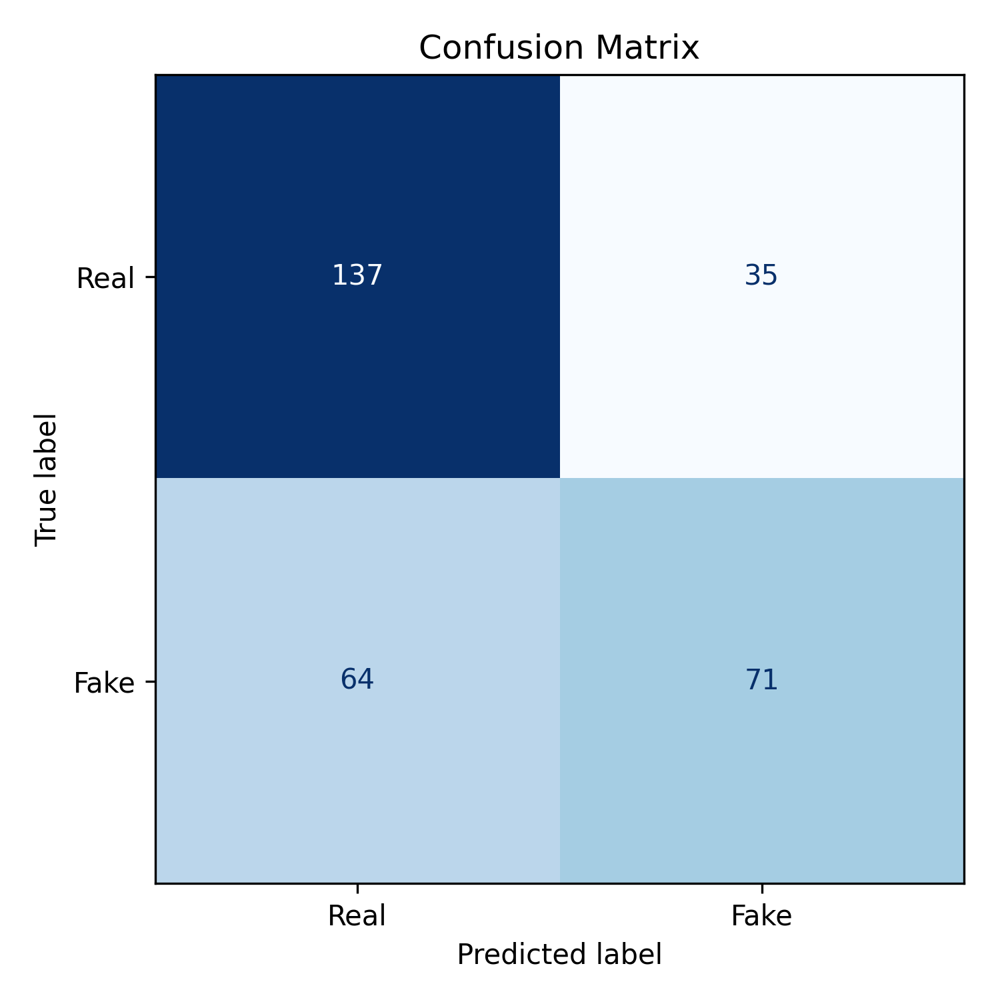
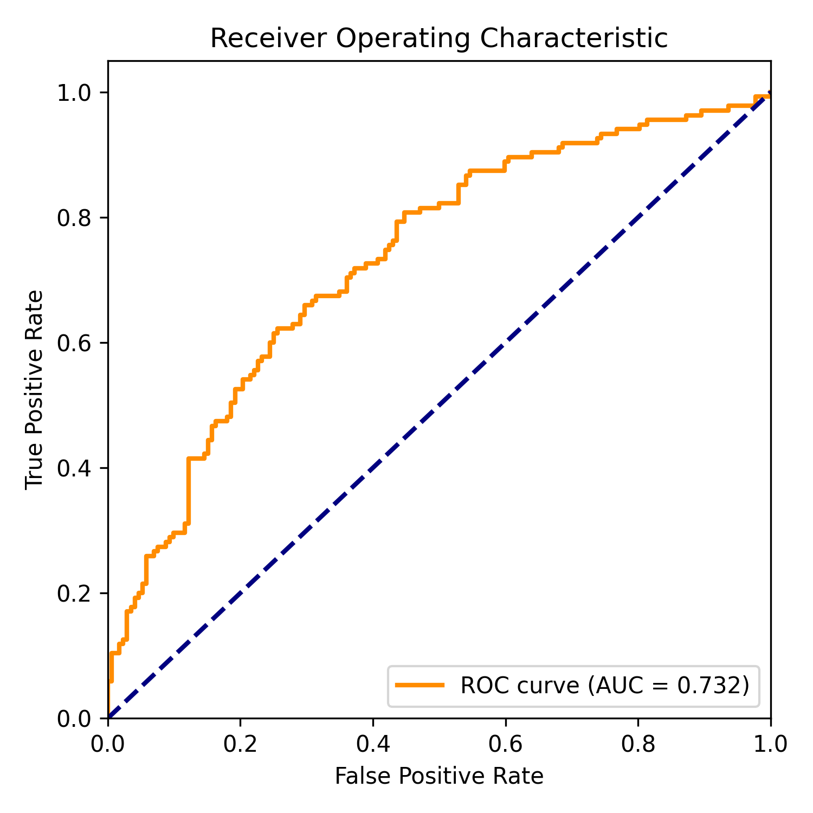

# DeepTrace: Deepfake Detection System

DeepTrace is a deep learning-based system designed to detect deepfake images using a hybrid approach that combines **spatial and frequency-based features**.

---

## 🚀 Overview

Deepfake technology can generate highly realistic fake images, making it difficult to distinguish between real and manipulated media.

DeepTrace addresses this problem by:

- Extracting **spatial features** using CNNs
- Extracting **frequency features** to capture hidden artifacts
- Combining both using a **fusion model**
- Classifying images as **Real** or **Fake**

---

## ✨ Features

- Deepfake image detection using deep learning
- Hybrid spatial-frequency feature extraction
- Model training and evaluation pipeline
- Performance metrics (Accuracy, Precision, Recall, F1 Score, AUC)
- Confusion matrix visualization
- ROC curve analysis
- Grad-CAM explainability for model interpretation

---

## 📁 Project Structure

DeepTrace/
│
├── train.py
├── test.py
├── config.py
├── requirements.txt
├── README.md
│
├── models/
├── utils/
├── dataset/
│
├── checkpoints/ # Model weights (ignored in GitHub)
│
└── results/
├── confusion_matrix.png
├── roc_curve.png
├── gradcam_sample_0_label_0.png
├── gradcam_sample_1_label_0.png
├── gradcam_sample_2_label_0.png
└── gradcam_sample_3_label_1.png

---

## ⚙️ Installation

Clone the repository:

git clone https://github.com/mohammedsalahuddin1313/DeepTrace.git

cd DeepTrace

Install dependencies:

pip install -r requirements.txt

---

## 🏋️ Training the Model

Run:

python train.py

This will train the model and save the best weights in:

checkpoints/best_fusion_model.pth

---

## 🧪 Testing the Model

Run:

python test.py

This will:

- Evaluate the model
- Generate performance metrics
- Save visual outputs (confusion matrix, ROC curve, Grad-CAM)

---

## 📊 Results

Model Performance:

- **Accuracy:** 67.75%
- **Precision:** 66.98%
- **Recall:** 52.59%
- **F1 Score:** 58.92%
- **AUC Score:** 0.73

---

## 📉 Confusion Matrix

---

## 📈 ROC Curve

---

## 🔥 Explainability (Grad-CAM)

Grad-CAM is used to visualize which regions of the image influence the model's decision.

It helps in understanding:

- Whether the model focuses on facial regions
- Detection of manipulation artifacts
- Model reliability

### Sample Outputs

---

## 🧠 Key Insights

- The model achieves **moderate performance** with 67.75% accuracy
- **AUC of 0.73** indicates good class separation capability
- **Recall is relatively low (52%)**, meaning some fake images are missed
- Grad-CAM confirms the model focuses on **important facial regions**

---

## ⚠️ Limitations

- Lower recall indicates missed deepfake samples
- Model performance can improve with:
  - More training data
  - Better architectures (e.g., EfficientNet)
  - Data augmentation

---

## 🛠️ Future Enhancements

- Improve recall and overall accuracy
- Add real-time image upload detection (Streamlit UI)
- Extend to video deepfake detection
- Deploy as a web application

---

## 📌 Notes

Due to GitHub file size limits, trained model weights (`.pth`) are not included.

To generate the model:

python train.py

---

## 👨‍💻 Authors

**Mohammed Salahuddin**
